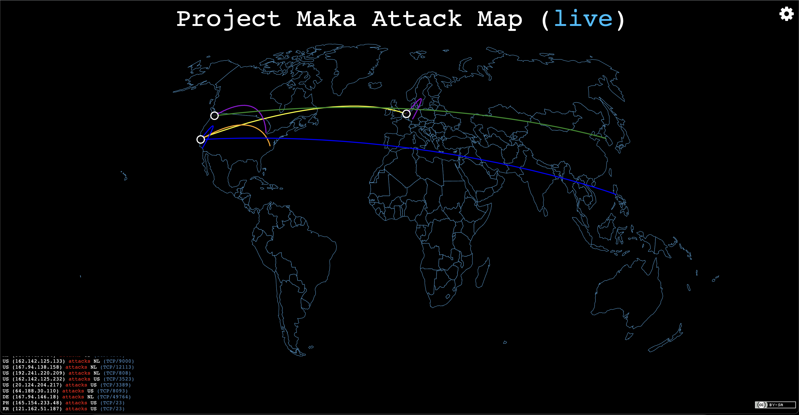

### pewpew-ws

pewpew-ws is a fork of @alexcpsec & @hrbrmstr's original project [https://github.com/hrbrmstr/pewpew](https://github.com/hrbrmstr/pewpew). Instead of using pre-generated statistical data, maps are drawn off of real-time data fed to it by the [pewpew-ws-server](https://github.com/en0io/pewpew-ws-server). pewpew-ws-server receives a CSV from a RabbitMQ queue that is published by the Project Maka backend.

The format of the CSV that this receives is as follows:

`$sourceip,$isp,$sourcelat,$sourcelon,$sourceISO3166,$destlat,$destlon,$destISO3166,$proto,$destport`

The latitude, longitude, ISP and ISO3166 country codes are pulled from GeoLite2 by the Project Maka backend.

Much like the original pewpew map, this utilizes the [datamaps](http://datamaps.github.io/) library.

